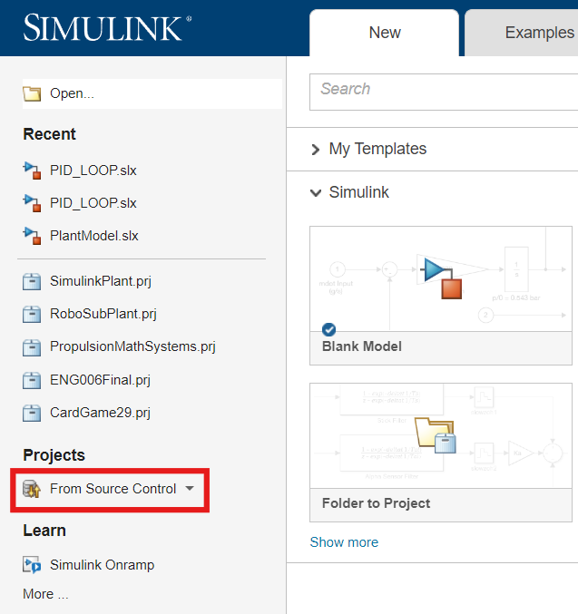
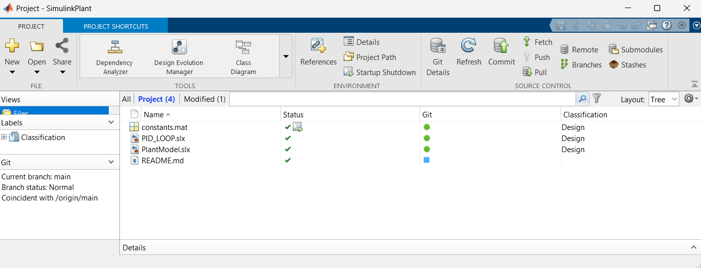
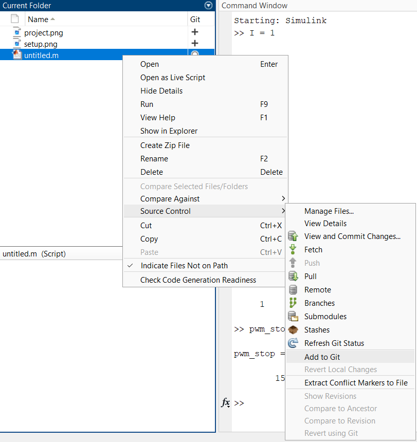

## Opening the Model
1. Install [MATLAB](https://www.mathworks.com/help/install/install-products.html)
2. Using MATLAB, install Simulink
3. After opening Simulink,  select `From Source Control` and then `Git`

4. After setting up Git, the project panel should open. From here you can begin work!

## Running and Maintaining the Model
**Always use the MATLAB Project source control.** MATLAB has developed this tool to prevent sharing of temporary files and other unwanted information. A project also has associated start-up files, so starting without first running the project will cause the Simulink model to fail. 

> [!WARNING]
> If you add additional files to the directory that you want source controlled, you need to manually add them to the project by right-clicking on the file and going `Source Control > Add to Git` 
> 

## Notes About This Model
- All position vectors and matrixes are with respect to the center of mass of the robot. 
  - ex:  `volume-center` is with respect to the center of mass
> [!NOTE] 
> **Message from Zenyn**
>
> Mathematically, its far more convenint to keep the convention that center-of-mass is origin. Practically, it might become annoying because the center of mass can change. 
> 
> I think the ideal solution is to keep the center of mass orgin, but at some point add a function that would redefine the center of mass relative to a static point (say, thruster 0), and then recalculate all other points, keeping the center of mass at origin.
